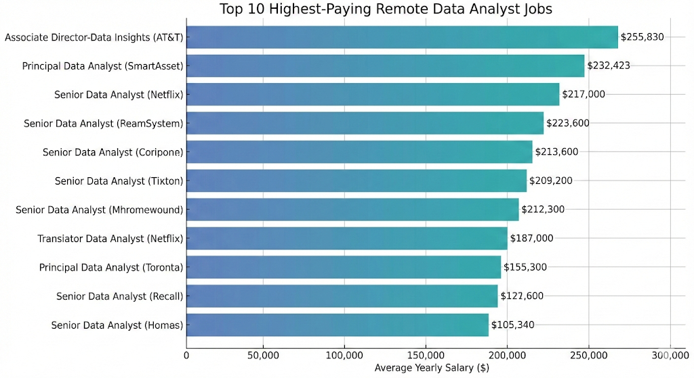

# Introduction
Welcome to my Data Analytics project! This repository showcases a deep dive into the Data Analyst job market, specifically focusing on remote opportunities. By analyzing a large dataset of job postings, I’ve identified the highest-paying roles, the most in-demand skills, and where these two intersect to define the optimal skills for anyone looking to enter or advance in the field.
Through this project, I explore:

* **Top-Paying Roles**: Identifying the elite tier of remote data analyst positions.

* **Skill Demand**: Pinpointing which technical skills are non-negotiable for employers.

* **Salary Insights**: Correlating specific technical expertise with high earning potential.
* SQL queries? Check them out here: [Project_sql_folder](project_sql/)
# Background
Driven by a desire to understand the Data Analyst job market more deeply, this project was born from a need to navigate the vast sea of job postings and identify the most lucrative and sustainable career paths.

The goal was to move beyond general advice and use actual data to pinpoint exactly which skills are worth investing time in for **Remote (Work from Home) roles**.

The project focuses on answering five core questions:

* What are the highest-paying Data Analyst roles available remotely?

* Which companies are leading the market in high-salary postings?

* Which technical skills are in the highest demand globally?

* Which specific skills are associated with the highest average salaries?

* What are the optimal skills that balance high demand with high pay?
# Tools I Used
For this project, I utilized the following tools to handle the dataset and extract insights:

* **SQL:** The backbone of my analysis, allowing me to query the database and unearth critical job market trends.
* **PostgreSQL:** My chosen database management system for handling the job posting relations.
* **Visual Studio Code:** My primary editor for writing and executing SQL scripts.
* **Git & GitHub:** Essential for version control and sharing my analysis with the data community.
# The Analysis 
### 1. Top Paying Data Analyst Jobs
To identify the highest-paying roles, I filtered for Data Analyst positions with specified salaries, focusing on Remote ("Anywhere") locations. This query highlights the top 10 most lucrative opportunities.
```sql
SELECT
    job_id,
    job_title,
    job_location,
    job_schedule_type,
    salary_year_avg,
    job_posted_date,
    name as company_name
FROM
    job_postings_fact j
LEFT JOIN
     company_dim ON company_dim.company_id = j.company_id      
WHERE 
    job_title_short = 'Data Analyst' AND salary_year_avg IS NOT NULL 
    AND job_location = 'Anywhere'
ORDER BY
    salary_year_avg DESC    
LIMIT 10;
````
**Insights:**
* Salary Range: The top 10 remote Data Analyst jobs show a significant salary potential, with the highest-paying role reaching an impressive $255,830 annually.

* Seniority Matters: The most lucrative positions are often not entry-level; job titles frequently include "Senior," "Principal," or "Director," indicating that experience and leadership command top-tier compensation.

* Diverse Employers: High-paying remote opportunities are not limited to one sector, with top roles offered by a mix of major tech companies (like Netflix and AT&T) and specialized firms across various industries.
  
<p align="center">
  
</p>

### 2. Skills for Top Paying Jobs
Building on the first query, this analysis explores which specific skills are required for these high-paying roles. It helps candidates understand what tools they need to master to land top-tier jobs.
```sql
WITH top_paying_jobs AS (
    SELECT
        job_id,
        job_title,
        salary_year_avg,
        name as company_name
    FROM
        job_postings_fact j
    LEFT JOIN
        company_dim ON company_dim.company_id = j.company_id      
    WHERE 
        job_title_short = 'Data Analyst' AND salary_year_avg IS NOT NULL 
        AND job_location = 'Anywhere'
    ORDER BY
        salary_year_avg DESC    
    LIMIT 10  
)

SELECT 
     top_paying_jobs.*,
     skills
FROM top_paying_jobs
INNER JOIN skills_job_dim ON top_paying_jobs.job_id = skills_job_dim.job_id    
INNER JOIN skills_dim ON skills_job_dim.skill_id = skills_dim.skill_id      
ORDER BY salary_year_avg DESC;
````

# What I Learned
# Conclusion
