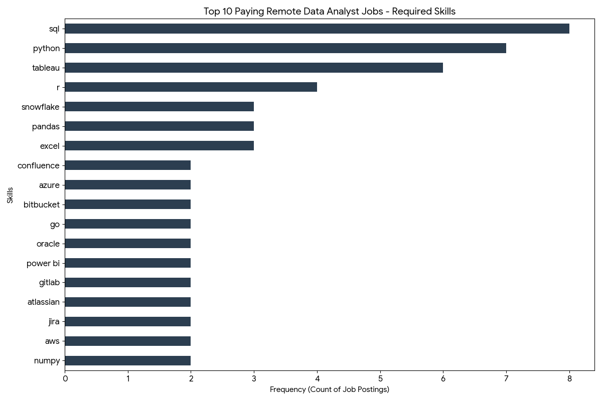

# Introduction
Welcome to my Data Analytics project! This repository showcases a deep dive into the Data Analyst job market, specifically focusing on remote opportunities. By analyzing a large dataset of job postings, I’ve identified the highest-paying roles, the most in-demand skills, and where these two intersect to define the optimal skills for anyone looking to enter or advance in the field.
Through this project, I explore:

* **Top-Paying Roles**: Identifying the elite tier of remote data analyst positions.

* **Skill Demand**: Pinpointing which technical skills are non-negotiable for employers.

* **Salary Insights**: Correlating specific technical expertise with high earning potential.
* SQL queries? Check them out here: [Project_sql/](project_sql/)
# Background
Driven by a desire to understand the Data Analyst job market more deeply, this project was born from a need to navigate the vast sea of job postings and identify the most lucrative and sustainable career paths.

The goal was to move beyond general advice and use actual data to pinpoint exactly which skills are worth investing time in for **Remote (Work from Home) roles**.

The project focuses on answering five core questions:

* What are the highest-paying Data Analyst roles available remotely?

* Which companies are leading the market in high-salary postings?

* Which technical skills are in the highest demand globally?

* Which specific skills are associated with the highest average salaries?

* What are the optimal skills that balance high demand with high pay?
# Tools I Used
For this project, I utilized the following tools to handle the dataset and extract insights:

* **SQL:** The backbone of my analysis, allowing me to query the database and unearth critical job market trends.
* **PostgreSQL:** My chosen database management system for handling the job posting relations.
* **Visual Studio Code:** My primary editor for writing and executing SQL scripts.
* **Git & GitHub:** Essential for version control and sharing my analysis with the data community.
# The Analysis 
### 1. Top Paying Data Analyst Jobs
To identify the highest-paying roles, I filtered for Data Analyst positions with specified salaries, focusing on Remote ("Anywhere") locations. This query highlights the top 10 most lucrative opportunities.
```sql
SELECT
    job_id,
    job_title,
    job_location,
    job_schedule_type,
    salary_year_avg,
    job_posted_date,
    name as company_name
FROM
    job_postings_fact j
LEFT JOIN
     company_dim ON company_dim.company_id = j.company_id      
WHERE 
    job_title_short = 'Data Analyst' AND salary_year_avg IS NOT NULL 
    AND job_location = 'Anywhere'
ORDER BY
    salary_year_avg DESC    
LIMIT 10;
````
**Insights:**
* Salary Range: The top 10 remote Data Analyst jobs show a significant salary potential, with the highest-paying role reaching an impressive $255,830 annually.

* Seniority Matters: The most lucrative positions are often not entry-level; job titles frequently include "Senior," "Principal," or "Director," indicating that experience and leadership command top-tier compensation.

* Diverse Employers: High-paying remote opportunities are not limited to one sector, with top roles offered by a mix of major tech companies (like Netflix and AT&T) and specialized firms across various industries.
  
<p align="center">
  
</p>

### 2. Skills for Top Paying Jobs
Building on the first query, this analysis explores which specific skills are required for these high-paying roles. It helps candidates understand what tools they need to master to land top-tier jobs.
```sql
WITH top_paying_jobs AS (
    SELECT
        job_id,
        job_title,
        salary_year_avg,
        name as company_name
    FROM
        job_postings_fact j
    LEFT JOIN
        company_dim ON company_dim.company_id = j.company_id      
    WHERE 
        job_title_short = 'Data Analyst' AND salary_year_avg IS NOT NULL 
        AND job_location = 'Anywhere'
    ORDER BY
        salary_year_avg DESC    
    LIMIT 10  
)

SELECT 
     top_paying_jobs.*,
     skills
FROM top_paying_jobs
INNER JOIN skills_job_dim ON top_paying_jobs.job_id = skills_job_dim.job_id    
INNER JOIN skills_dim ON skills_job_dim.skill_id = skills_dim.skill_id      
ORDER BY salary_year_avg DESC;
````
This query provides a detailed look at the specific tools and technologies required for the highest-paying Data Analyst roles. By joining our top 10 jobs with the skills database, we can identify the specific "tech stack" needed to qualify for a $\$200k+$ salary.
**Most common skills in top-paying jobs:**
* sql (8/8 roles, 100%)
* python (7/8, 87.5%)
* tableau (6/8, 75%)
* r (4/8, 50%)
### Insights:
* **SQL & Python Dominance:** SQL is required in $100\%$ of the top-paying roles, and Python follows closely behind ($7$ out of $8$ roles), reinforcing them as the most critical "hard skills" for data analysts.
* **Visualization is Key:** Tableau is the preferred visualization tool for high-salary positions, appearing significantly more often than Power BI in this elite tier.
* **Cloud & Advanced Analysis:** High-paying roles often demand a combination of cloud platforms (Azure, AWS, Snowflake) and Python libraries like Pandas and NumPy for complex data manipulation.
* 

* This bar chart shows the frequency of each skill within the highest-paying job postings, highlighting the standard "Data Analyst Stack" for top-tier remote roles.

### 3. Top Demanded Skills
Top Demanded Skills section shifts from "highest salary" to "highest volume." This query identifies the skills that appear most frequently across all remote Data Analyst job postings, representing the most stable "core" for any job seeker. It captures the most requested skills in remote Data Analyst roles (demand-side view, not salary-side)
```sql
SELECT
      skills,
      count(skills_dim.skill_id) demand_count
FROM
    job_postings_fact j
INNER JOIN skills_job_dim on  
    j.job_id = skills_job_dim.job_id
INNER JOIN skills_dim on
    skills_job_dim.skill_id = skills_dim.skill_id
WHERE job_title_short = 'Data Analyst'
    AND job_work_from_home = TRUE
GROUP BY skills 
ORDER BY demand_count DESC
LIMIT 5;
````

### Insights:
* **The "Non-Negotiable" Trio:** SQL, Excel, and Python are the undisputed leaders in demand, appearing in thousands of job postings. This confirms that these three form the essential foundation for any remote data analyst.

* **Visualization Preference:** In the broader market, Tableau edges out Power BI as the most demanded visualization tool for remote roles, though both remain highly relevant.

* **Remote Market Stability:** The high volume of postings for these skills suggests a mature and stable job market for analysts who can work effectively from home.

 #### Skill | Demand Count
SQL -- 7,291  

Excel -- 4,677 

Python -- 4,330  

Tableau -- 3,745  

Power BI -- 2,609  


 1 **SQL** is the clear baseline skill: 7,291 postings (highest by far).
 
 2 **Excel** is still extremely relevant: 4,611, which confirms business-facing analyst work is still dominant.
 
 3 **Python** (4,330) + **BI tools** (Tableau 3,745, Power BI 2,609) show employers want both coding and dashboard delivery.
 
 4 The top 5 are a balanced stack: **querying + spreadsheet + programming + visualization.**
 
**Top-5 share (within these 5 skills)**

* SQL: 32.3%
* Excel: 20.4%
* Python: 19.2%
* Tableau: 16.6%
* Power BI: 11.6%

### 4. Top Paying Skills
This analysis reveals the "hidden gems" of the data analytics market—the niche skills that, while perhaps less common, command the highest average salaries. This query highlights which technical competencies provide the most significant financial leverage. 
```sql
SELECT
      skills,
      round(avg(salary_year_avg),0)avg_salary
FROM
    job_postings_fact j
INNER JOIN skills_job_dim on  
    j.job_id = skills_job_dim.job_id
INNER JOIN skills_dim on
    skills_job_dim.skill_id = skills_dim.skill_id
WHERE job_title_short = 'Data Analyst'
    AND salary_year_avg IS NOT NULL
    AND job_work_from_home = TRUE 
GROUP BY skills
ORDER BY  avg_salary DESC
LIMIT 25
````
### Quick Insights
* **Big Data & Engineering Premium:** PySpark leads the list with an average salary of $208,172, indicating that Data Analysts who can bridge the gap into Data Engineering or Big Data processing are highly valued.

* **DevOps & Version Control:** High salaries for Bitbucket, GitLab, and Jenkins suggest that companies pay a premium for analysts who understand professional software development workflows and CI/CD pipelines.

* **Specialized Libraries:** Proficiency in advanced Python libraries like Pandas, NumPy, and Scikit-learn is consistently associated with salaries above $125,000, proving that deep technical expertise in data science pays off.
### Top 25 Highest-Paying Skills (Remote Data Analyst)

| Rank | Skill | Avg Salary (USD) |
|---:|---|---:|
| 1 | pyspark | 208,172 |
| 2 | bitbucket | 189,155 |
| 3 | couchbase | 160,515 |
| 4 | watson | 160,515 |
| 5 | datarobot | 155,486 |
| 6 | gitlab | 154,500 |
| 7 | swift | 153,750 |
| 8 | jupyter | 152,777 |
| 9 | pandas | 151,821 |
| 10 | elasticsearch | 145,000 |
| 11 | golang | 145,000 |
| 12 | numpy | 143,513 |
| 13 | databricks | 141,907 |
| 14 | linux | 136,508 |
| 15 | kubernetes | 132,500 |
| 16 | atlassian | 131,162 |
| 17 | twilio | 127,000 |
| 18 | airflow | 126,103 |
| 19 | scikit-learn | 125,781 |
| 20 | jenkins | 125,436 |
| 21 | notion | 125,000 |
| 22 | scala | 124,903 |
| 23 | postgresql | 123,879 |
| 24 | gcp | 122,500 |
| 25 | microstrategy | 121,619 |
  
### 5. Optimal Skills

This final analysis combines the previous two queries to identify the "Sweet Spot" in the job market: skills that are both high in demand and offer high average salaries. By filtering for skills that appear in more than 10 job postings, we ensure the results are statistically significant and represent actual market trends rather than outliers.  
```sql
WITH skills_demand AS (
    SELECT
          skills_dim.skill_id,
          skills_dim.skills,
          count(skills_dim.skill_id) AS demand_count
    FROM
        job_postings_fact j
    INNER JOIN skills_job_dim ON j.job_id = skills_job_dim.job_id
    INNER JOIN skills_dim ON skills_job_dim.skill_id = skills_dim.skill_id
    WHERE job_title_short = 'Data Analyst'
        AND job_work_from_home = TRUE
        AND salary_year_avg IS NOT NULL
    GROUP BY skills_dim.skill_id
),   
avg_skills_salary AS (
    SELECT
        skills_job_dim.skill_id,
        round(avg(salary_year_avg),0) AS avg_salary
    FROM
        job_postings_fact j
    INNER JOIN skills_job_dim ON j.job_id = skills_job_dim.job_id
    INNER JOIN skills_dim ON skills_job_dim.skill_id = skills_dim.skill_id
    WHERE job_title_short = 'Data Analyst'
        AND salary_year_avg IS NOT NULL
        AND job_work_from_home = TRUE 
    GROUP BY skills_job_dim.skill_id
)

SELECT
     skills_demand.skill_id,
     skills_demand.skills,
     demand_count,
     avg_salary
FROM
    skills_demand
INNER JOIN avg_skills_salary ON skills_demand.skill_id = avg_skills_salary.skill_id  
WHERE demand_count > 10     
ORDER BY
     avg_salary DESC,
     demand_count DESC
LIMIT 25;
````
### Key Insights:
* **Cloud & Big Data are Winners:** Tools like Go, Snowflake, and Azure represent the best balance for a career, appearing frequently in job postings while maintaining average salaries well above $100,000.

* **Programming Languages:** Python and R remain the "Gold Standard." While Python has higher volume, both consistently lead to higher-paying remote roles compared to basic spreadsheet analysis.

* **Modern Data Stack:** Proficiency in "Modern Data Stack" tools (like Looker and Tableau) coupled with backend skills (SQL, Oracle) creates a highly "optimal" profile that recruiters are actively searching for and willing to pay for.

#### Optimal Skills (High Demand + High Salary) for Remote Data Analyst Roles

| Skill ID | Skill | Demand Count | Avg Salary (USD) |
|---:|---|---:|---:|
| 8 | go | 27 | 115,320 |
| 234 | confluence | 11 | 114,210 |
| 97 | hadoop | 22 | 113,193 |
| 80 | snowflake | 37 | 112,948 |
| 74 | azure | 34 | 111,225 |
| 77 | bigquery | 13 | 109,654 |
| 76 | aws | 32 | 108,317 |
| 4 | java | 17 | 106,906 |
| 194 | ssis | 12 | 106,683 |
| 233 | jira | 20 | 104,918 |
| 79 | oracle | 37 | 104,534 |
| 185 | looker | 49 | 103,795 |
| 2 | nosql | 13 | 101,414 |
| 1 | python | 236 | 101,397 |
| 5 | r | 148 | 100,499 |
| 78 | redshift | 16 | 99,936 |
| 187 | qlik | 13 | 99,631 |
| 182 | tableau | 230 | 99,288 |
| 197 | ssrs | 14 | 99,171 |
| 92 | spark | 13 | 99,077 |
| 13 | c++ | 11 | 98,958 |
| 186 | sas | 63 | 98,902 |
| 7 | sas | 63 | 98,902 |
| 61 | sql server | 35 | 97,786 |
| 9 | javascript | 20 | 97,587 |

**1 Best pay + demand balance** sits with modern data stack skills: snowflake, azure, aws, python, tableau, looker.

**2 Highest salary skills are niche** in this set:
 * go ($115,320, demand 27)
 * confluence ($114,210, demand 11)
 * hadoop ($113,193, demand 22)
   These pay well but appear in fewer postings.
   
**3 Most marketable skills by demand:**
 * python (236, $101,397)
 * tableau (230, $99,288)
 * r (148, $100,499)
   These are strong “core” skills with scale.
   
**4 Cloud + warehouse tools command premium pay:**
 * snowflake ($112,948), azure ($111,225), aws ($108,317), bigquery ($109,654), redshift ($99,936).


# What I Learned
# Conclusion
